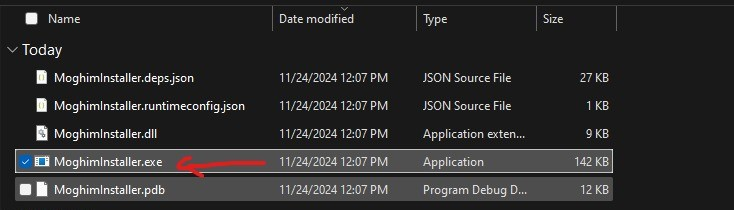
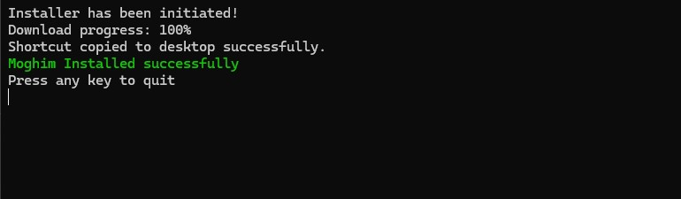
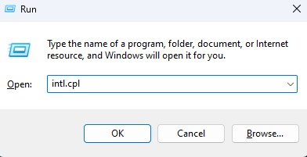
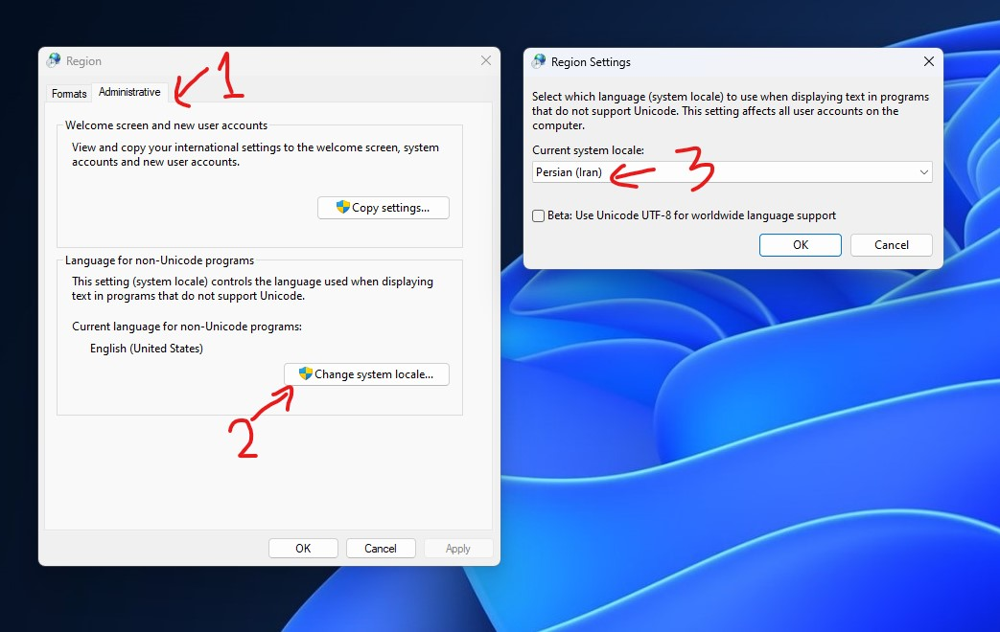

# نصب نرم افزار های مقیم (هورگشت)

۱. این [فایل](https://samanqaydi.com/MoghimInstaller.zip) را دانلود کنید و 
سپس آن را از حالت فشرده خارج کنید.

۲. سپس MoghimInstaller.exe را اجرا کنید و منتظر باشید تا فایل ها مورد نیاز دانلود و نصب شود.

۳. زمانی که پیام نصب موفقیت آمیز را مشاهده کردید،‌میتوانید برنامه ها را روی دسکتاپ خود مشاهده کنید.

> نکته: برای دریافت کد فعال سازی نرم افزار با پشتیبانی تماس بگیرید.

> اگر با مشکل مشاهده علامت سوال در برنامه مواجه شدید مراحل زیر را دنبال کیند

۱. منو استارت را باز کرده و سپس برنامه Run را باز کنید.

۲. عبارت intl.cpl را وارد کرده و OK را بزنید.

۳. سپس وارد سربرگ Administrative شوید و Change system locale را بزنید.

۴. در آنجا از لیست گزینه Persian (Iran) را انتخاب کنید و OK را بزنید.

۵. با درخواست Restart سیستم موافق کنید

